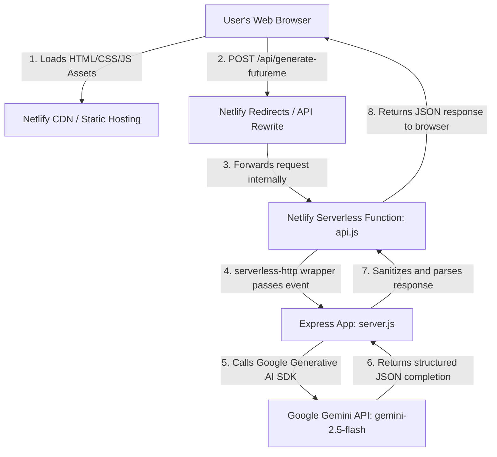

# FutureMe - Meet Your Future Self

FutureMe is a premium AI-powered personal reflection product built during Nitish's Founder Labs. By answering questions about your current life, goals, struggles, and one-year vision, FutureMe builds an interactive bridge to the person you are becoming. 

Using Google's Gemini API, the app generates a powerful, emotionally intelligent response card from your future self, followed by an immersive chat section where you can dialogue directly with your future self in your selected tone.

---

## Tech Stack

The application is built using a modern, lightweight, and performant full-stack architecture:

- **Frontend**:
  - **HTML5 & Vanilla CSS3**: Apple-style premium dark design featuring glassmorphism (`backdrop-filter`), floating blurred orbs, and custom scrollbars.
  - **Vanilla JavaScript (ES6+)**: Handles state management, dynamic multi-stage loading portals, DOM manipulation, smooth view scrolls, clipboard actions, and real-time chat histories.
  - **Intersection Observer API**: Triggers premium slide-up fade animations as the user scrolls.

- **Backend & Serverless API**:
  - **Node.js**: Asynchronous event-driven runtime environment.
  - **Express**: Lightweight routing framework managing incoming requests, request validations, and routing prefixes.
  - **CORS**: Handles Cross-Origin Resource Sharing.
  - **Serverless-HTTP**: Wraps the Express app, transforming it into an event-driven AWS Lambda-compatible function handler suitable for serverless platforms like Netlify.

- **Artificial Intelligence**:
  - **Google Gemini API**: Utilizing **`gemini-2.5-flash`** for ultra-fast, emotionally intelligent, and custom-structured text completions.
  - **JSON Response Mode**: Leverages Gemini's native JSON output mode (`responseMimeType: "application/json"`) to ensure data is structured and parsed with 100% reliability.

- **Hosting & Deployment**:
  - **Netlify**: Serverless cloud hosting for static frontend assets and backend serverless functions, connected through automated routing rewrites.
  - **Netlify CLI**: Used for fast terminal-based continuous deployments.

---

## System Architecture

The project employs a serverless-wrapped monolithic architecture, meaning the same codebase runs as a standard Node/Express server locally, but runs serverlessly in production on Netlify.

### Visual Architecture Flow


### Sequence Flow Diagram


### Local vs. Production Execution:
- **Local (Offline/Dev)**: Running `npm run dev` starts the Express app on port `5000` directly. The Express server serves both the static files inside the `frontend` folder and the API routes.
- **Production (Netlify)**: Netlify hosts the `frontend` folder statically on its global CDN. Any HTTP request going to `/api/*` is internally proxied (rewritten) to the serverless function handler (`netlify/functions/api.js`) which runs our router logic without any cold-start proxy issues.

---

## Project Structure

```text
futureme/
  frontend/
    index.html   # Apple-style premium user interface
    style.css    # Core design system & glassmorphism components
    script.js    # Form state, dynamic loading sequences, chat, and API integrations
  backend/
    server.js    # Node.js + Express API server 
    package.json # Dependencies (Express, CORS, Dotenv, Google Generative AI)
    .env.example # Environment variable setup template
  README.md      # Documentation
```

---

## Getting Started

### 1. Prerequisite
Ensure you have [Node.js](https://nodejs.org/) installed on your machine.

### 2. Backend Setup
Navigate to the backend directory and install the necessary npm dependencies:

```bash
cd backend
npm install
```

### 3. Setup Gemini API Key
Create a `.env` file in the `backend/` directory based on the `.env.example` template:

```bash
cp .env.example .env
```

Open the newly created `.env` file and replace the placeholder with your actual Google Gemini API key:

```text
GEMINI_API_KEY=your_actual_gemini_api_key
PORT=5000
```

### 4. Run the Backend Server
Start the development server with hot-reloading (via nodemon):

```bash
npm run dev
```

The backend server will run on [http://localhost:5000](http://localhost:5000).

### 5. Open the Application
The backend server serves the frontend files statically. Simply open your browser and navigate to:
- **[http://localhost:5000](http://localhost:5000)** (Recommended: avoids all local browser CORS restrictions)

Alternatively, you can:
1. **VS Code Live Server**: Right-click `frontend/index.html` and choose **Open with Live Server**.
2. **Direct File**: Double-click `frontend/index.html` in your browser. (The app will automatically route requests back to the local backend).

---

## API Routes Documentation

### 1. Generate FutureMe Result
- **Endpoint**: `POST /api/generate-futureme`
- **Request Body**:
  ```json
  {
    "name": "Shanmuk",
    "age": "30",
    "goal": "Build a successful AI startup",
    "struggle": "Lack of consistency",
    "oneYearVision": "Running a profitable AI company",
    "tone": "Brutally Honest"
  }
  ```
- **Response**:
  ```json
  {
    "success": true,
    "data": {
      "message": "Listen to me, Nitish...",
      "futureIdentity": "The AI company founder who stopped negotiating with dreams.",
      "nextMoves": [
        "Cut out one major distraction today.",
        "Set a hard deadline for this week's tasks.",
        "Stop talking and ship your V1."
      ],
      "habit": "Do the hardest task first thing in the morning.",
      "warning": "Do not let minor roadblocks delay your deployment timeline.",
      "mantra": "Action cures fear."
    }
  }
  ```

### 2. Chat with FutureMe
- **Endpoint**: `POST /api/chat-futureme`
- **Request Body**:
  ```json
  {
    "userProfile": {
      "name": "Shanmuk",
      "age": "23",
      "goal": "Build a successful AI startup",
      "struggle": "Lack of consistency",
      "oneYearVision": "Running a profitable AI company",
      "tone": "Brutally Honest"
    },
    "chatHistory": [
      {
        "role": "user",
        "message": "Will I actually make it?"
      },
      {
        "role": "futureme",
        "message": "Only if your daily actions stop negotiating with your dreams."
      }
    ],
    "question": "What should I focus on this week?"
  }
  ```
- **Response**:
  ```json
  {
    "success": true,
    "reply": "Focus on shipping a single core feature. Cut all secondary UI elements. You need to prove your concept before scaling."
  }
  ```

---

## Features & Implementation Details
- **Tone Personalization**: The generated responses are mapped to four tones:
  - *Motivational*: Warm, inspiring, and supportive.
  - *Brutally Honest*: Direct, sharp, and execution-centric.
  - *Calm Mentor*: Peaceful, wise, and grounded.
  - *CEO Mode*: Strategic, organized, and leverage-heavy.
- **Micro-interactions**: Glassmorphism visual cues, custom loader messages, smooth viewport scrolling to results and chat, copy to clipboard notification, and dynamic typing state.
- **Safety & Error Handling**: Sanitized HTML outputs, API loading inhibitors to prevent double click submissions, rate checks, and clean formatting helper logic to handle Gemini's JSON blocks securely.

---

## Deploying to Netlify

You can deploy this fullstack project directly to Netlify! The Node.js Express server is pre-configured to build into a serverless Netlify function wrapper using `serverless-http`.

### Method 1: Git-based Deployment (Recommended)
1. Commit this codebase and push it to a new GitHub repository.
2. Go to the [Netlify Dashboard](https://app.netlify.com/) and click **Add new site** -> **Import from Git**.
3. Select your repository.
4. Set the following build configuration details:
   - **Base directory**: `futureme`
   - **Build command**: *Leave blank*
   - **Publish directory**: `frontend`
5. Go to **Site Configuration** -> **Environment variables**, click **Add variable**, and define:
   - **Key**: `GEMINI_API_KEY`
   - **Value**: *your_actual_gemini_api_key*
6. Click **Deploy Site**. Netlify will automatically build the serverless functions and host the premium frontend!

### Method 2: Netlify CLI Deployment
1. Install the Netlify CLI globally:
   ```bash
   npm install -g netlify-cli
   ```
2. Navigate to the `futureme` folder in your terminal:
   ```bash
   cd futureme
   ```
3. Initialize the site and link it to your account:
   ```bash
   netlify init
   ```
4. Deploy the site to production:
   ```bash
   netlify deploy --prod
   ```
5. Configure your `GEMINI_API_KEY` environment variable in the Netlify dashboard under Site Configuration.
